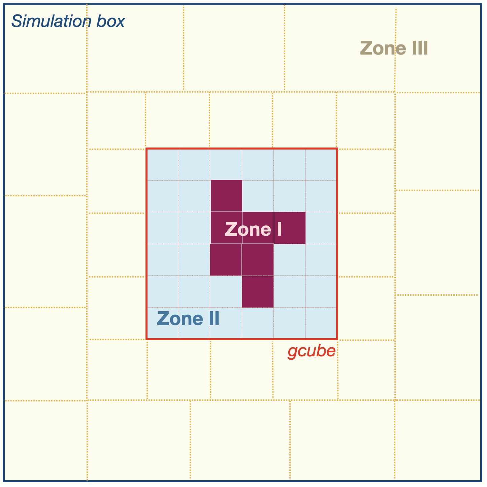

.. _particle_load_algorithm:

==================================
How the particle load is generated
==================================

General concept
---------------
The purpose of the particle load generator is to create a distribution of
particles with many high-resolution (low-mass) particles in the volume
specified by the (pre-computed) mask, and then gradually reducing resolution
(increased particle masses) in the remaining simulation volume.

For simplicity, the particle load is constructed in a frame in which the mask
centre sits in the centre of the simulation box; at the end it is shifted to
the appropriate place. With the mask sitting at the centre, a cubic region
("gcube") extending slightly beyond the mask is gridded into uniform cubic
cells. The size of these cells depends on the desired resolution in the zoom
region, and on the number of particles to be placed into each cell (see
below). Each cell that intersects one of the mask cells is then assigned to
the highest resolution level (lowest particle mass), "Zone I". The remaining
cells make up "Zone II", and they will contain successively fewer particles
per cell the further away they are from Zone I. The remaining volume, "Zone
III" is filled with concentric cubic shells of cells that increase
progressively in size outwards, and only contain a single particle each, with
a mass that increases propertional to the cell volume.

During the entire construction, the mask is placed at the centre of the
simulation cube. At the end, the particle load is shifted appropriately
(and periodically wrapped), so that the high-resolution region ends up in the
appropriate place within the box.
	
Basic parameters
----------------
* ``sim_name``: Label for the ICs
* ``cosmology``: Name of the cosmology to be used
* ``box_size``: Side length of the full simulation box [Mpc]. This one is
  only required for uniform-volume simulations, for zooms the box size is
  read from the mask file.
* ``icgen_object_dir``: Base directory for all `ic_gen` runs of this object
  (see :ref:`default file structure <structure>`). The `ic_gen` working
  directory will be set up as a subdirectory of it, with name ``sim_name``.
  If it is omitted, ``icgen_work_dir`` must be specified.
* ``icgen_work_dir``: Path to the `ic_gen` working directory (can be anywhere
  on the system). If it is omitted, ``icgen_object_dir`` must be specified
  and ``icgen_work_dir`` will be implicitly set to the subdirectory
  ``sim_name`` within it.

Setting up the gcube
--------------------
Apart from the mask, two other factors affect the particle distribution
within the gcube. The first is the resolution within the zoom region (i.e.
Zone I). For consistency with uniform-volume simulations, this is expressed
as the number of particles per dimension (n\ :sub:`equiv`) that the
simulation would have if the entire (parent) box were realized at this
resolution. It is also possible to specify a target particle mass; the code
will then find the closest possible n\ :sub:`equiv` (see below).

Secondly, each cell of the gcube (here and in the code referred to as "gcell"
to distinguish them from the mask cells) may contain more than one particle.
This allows the small-scale particle distribution to be realized as a glass,
rather than a Cartesian grid, for improved numerical stability. The combination
of box size (L\ :sub:`box`\ ), particle load per cell (n\ :sub:`cell` particles
per cell per dimension), and n\ :sub:`equiv` then sets the gcell size as
l\ :sub:`cell` = L\ :sub:`box` * n\ :sub:`cell` / n\ :sub:`equiv`.

The gcube is set up to cover at least the whole mask in each dimension
(generally it extends slightly beyond it to allow for an integer number of
gcells), plus a user-defined number of "padding gcells" on each side to allow
for improved resolution decay within Zone II.

gcube-related parameters
^^^^^^^^^^^^^^^^^^^^^^^^

* ``is_zoom``: [Required] Master switch to set up a zoom simulation, i.e. one
  in which the gcube does not cover the entire simulation box.
* ``mask_file``: [Required for zooms] The name of the mask file to use, as
  produced by :ref:`make_mask.py <make_mask>`. It can either be a simple
  file name if the mask file is in the ``icgen_object_dir``, or a full path
  to it otherwise.
* ``uniform_particle_number``: The total number of particles that the
  simulation would have if the entire box were filled at the zoom resolution.
  It must be an integer cube multiple of ``zone1_gcell_load`` (see below),
  to have an integer number of gcells across the box. Alternatively,
  ``uniform_particle_n`` or ``target_mass`` can be specified.
* ``uniform_particle_n``: Cube root of ``uniform_particle_number``, i.e. the
  number of particles *per dimension* to fill the whole box at zoom resolution.
  This must be an integer multiple of ``zone1_gcell_load``\**(1/3).
* ``target_mass``: Alternative way of setting the zoom resolution, the
  desired mass of one particle in the zoom region in M_Sun. Its exact meaning
  depends on ``target_mass_type`` (see next). **Note**: the actual particle
  mass will in general differ slightly from this value, to satisfy the
  constraints on n\ :sub:`equiv` described above.
* ``target_mass_type``: Specifies what exactly is mean by ``target_mass`` for
  simulations with baryons (for DM-only simulations, there is only one
  particle type so no ambiguity). Options are:

  * ``dmo`` (default): the mass is that of a DM particle in an equivalent
    DM-only simulation (i.e. the sum of DM and baryon particle masses
    for simulations with initially equal number of the two species).
  * ``dm``: the mass is that of a DM particle in the actual hydro simulation.
  * ``gas``: the mass is that of a gas particle in the actual hydro simulation.
  * ``mean``: the mass is the average across DM and gas particles. This option
    only works if gas particles are already identified here at the particle
    load generation stage (see ``identify_gas`` below).
    
  Note that for ``dm`` and ``gas`` it does not matter whether the DM/gas split
  happens already here in the particle load generation or later in SWIFT
  (as long as consistent cosmology parameters are used).

* ``zone1_gcell_load``: The number of particles per gcell in the zoom-in region
  (Zone I). It must be a cube.
* ``zone1_type``: The pattern type to use for the gcells in Zone I: ``glass``
  (default) or ``grid``. If ``glass`` is chosen, make sure that a glass file
  with the appropriate number of particles exists.
* ``zone2_type``: The pattern type to use for the gcells in Zone II: ``glass``
  or ``grid``.
* ``gcube_n_buffer_cells``: Number of gcells to add beyond the edge of the
  mask in each dimension, as additional buffer for Zone II (default: 2).
* ``gcube_min_size_mpc``: Minimum allowed side length of the gcube in Mpc.
  This can be used to increase the volume of Zone II for convergence tests.
  Default: 0, i.e. no hard minimum is imposed.
* ``glass_files_dir``: Directory in which the glass files are stored (by
  default, the ones included in the repository are used, at ``./glass_files``).
  This is only needed if either ``zone1_type: glass`` or ``zone2_type: glass``.
  
  
Direct generation of gas particles
----------------------------------
For hydro simulations, the code offers the option to generate DM and gas
particles directly at the particle load stage, rather than only during SWIFT
setup. This has some consistency benefits, and also allows generating
particle loads with **different numbers of gas and DM particles**. There are
two ways of doing this: either an appropriate fraction of the particles
in each gcell are (randomly) assigned as DM and gas, or the particles within
each gcell are copied and shifted a certain number of times to generate
DM particles and the originally present particles assigned as gas. Both are
described here.

* ``identify_gas``: Master switch to enable DM and gas particles to be
  separated at the particle load level (default: ``False``).
* ``generate_extra_dm_particles``: Switch to activate the generation of extra
  particles within each gcell (default: False), rather than assigning a
  fraction of the n\ :sub:`cell`:sup:`3` particles per cell as DM or gas.
* ``extra_dm_particle_scheme``: Can be used to specify the exact replication
  method to generate extra DM particles, for ratios with more then one option
  (3x, 4x, 7x). See below for details.
* ``dm_to_gas_number_ratio``: Desired ratio of DM to gas particle numbers. In
  random assignment mode, the actual ratio may differ slightly to accommodate
  an integer number of particles (especially if n\ :sub:`cell` is small).
  With extra particle generation, it has to be an integer and is used exactly.
  A value of 1 means that there will be (almost) equal numbers of DM and gas
  particles, >1 gives more DM than gas particles.
* ``dm_to_gas_mass_ratio``: As an alternative to ``dm_to_gas_number_ratio``,
  the mass ratio between DM and gas particles can be specified, but only if
  species are distinguished by random assignment (for generating
  systematically shifted copies, the integer number ratio must be specified).

.. note::
   Be aware of some subtleties when specifying the
   resolution for a particle load consisting of DM and gas particles. Without
   extra DM particles (``generate_extra_dm_particles: False``), the full-box
   equivalent particle number n\ :sub:`equiv` refers to the sum of both
   DM and gas particles (i.e. the DM particles in the hydro simulation will
   be more massive than for a DM-only simulation with the same
   n\ :sub:`equiv`\. If extra particles are to be generated, n\ :sub:`equiv`
   refers to gas particles only, i.e. the DM particles will be less massive
   than in DM-only, even with ``dm_to_gas_number_ratio: 1`` (in the same way
   as when gas is generated within SWIFT). If the resolution
   is specified through ``target_mass`` and ``target_mass_type``,
   n\ :sub:`equiv` is always calculated appropriately, irrespective of
   whether and how DM and gas particles are split.
   
  
Random assignment
^^^^^^^^^^^^^^^^^
This is quite straightforward: starting from the distribution of particles
within a gcell (glass or cubic grid), an appropriate number N\ :sub:`DM` of
particles are assigned as DM, and the rest as gas. Note that this assignment
is only done once, i.e. all gcells remain exact copies of each other. The
mass of DM and gas particles is then assigned appropriately so that their ratio
is equal to the cosmic mean and the sum of all particle masses in the gcell
is the cosmic mean corresponding to its volume.

.. warning::
   Use this option with care. If the DM and gas particles have different
   masses, the resulting particle distribution is no longer balanced and
   some level of numerical structure formation is likely to happen. Limited
   tests have shown that ``dm_to_gas_mass_ratio == 1`` avoids this, although
   there may still be some impact on e.g. the star formation history at
   very high redshift.

Replicative assignment
^^^^^^^^^^^^^^^^^^^^^^
This is similar to the method described in
`Richings et al. (2021) <https://arxiv.org/abs/2005.14495>`_ (which corresponds
approximately to ``dm_to_gas_number_ratio == 7`` with
``extra_dm_particle_scheme == subcube``). The kernel (original particle
distribution within each gcell) is replicated N times, with each replication
shifted by a certain amount in a certain direction. The general idea is to
set up a structure with a high degree of symmetry, so that forces on each
particle cancel exactly even when DM and gas particles have substantially
different masses.

.. note::
   This symmetry can only be achieved if the original kernel is a grid, rather
   than a glass distribution (i.e. with ``zone1_type == grid``). However,
   empirically this also works well with glass distributions, even in the
   quite extreme case of an equal number of DM and gas particles (as used
   in e.g. EAGLE). Nevertheless, the user is strongly encouraged to perform
   appropriate tests with this option before any production runs.

Schemes are currently implemented that allow 1x, 3x, 4x, 6x, and 7x as many
DM particles as gas particles. For ratios with more than one scheme, the
parameter ``extra_dm_particle_scheme`` can be used to specify which one to use.

In brief, the options are:

* *1x, body-centred cubic*: same method as that used by SWIFT to generate
  gas particles. DM particles are offset by [+0.5, +0.5, +0.5] mean
  (unreplicated) inter-particle spacings for a body-centred cubic lattice.

* *3x, face-replicated*: each DM replication is offset by +0.5 mean
  inter-particle spacings along the x, y, and z axis, respectively
  (default for 3x, ``extra_dm_particle_scheme: face``).

* *3x, edge-replicated*: as face-replicated, but each of the three DM
  particles is offset by +0.5 mean inter-particle spacings along two axes
  simultaneously (``extra_dm_particle_scheme: edge``).

* *4x, face-replicated*: as for 3x, but with an additional copy offset by
  +0.5 mean inter-particle spacings along all three axes (in other words,
  a combination of 1x and 3x face-replicated). Default for 4x (
  ``extra_dm_particle_scheme: face``).

* *4x, edge-replicated*: as for 3x, but with an additional copy offset by +0.5
  mean inter-particle spacings along all three axes (in other words, a
  combination of 1x and 3x edge-replicated;
  ``extra_dm_particle_scheme: edge``).

* *4x, sub-square*: this one has the four DM particles arranged in a square
  of side length equal to half the mean gas inter-particle separation. The
  centre of the square is offset by +0.5 mean inter-particle separations from
  the gas particle along each axis and the square lies in the xy plane
  (``extra_dm_particle_scheme: square``).

* *6x, inverse body-centred cubic*: Combination of the two 3x schemes.

* *7x, subcube*: seven DM particles are placed for each gas particle, offset
  by all permutations of {0, +0.5} mean inter-particle separations except for
  [0, 0, 0]. In this way, the particle distribution is equivalent to a grid
  with twice as high n\ :sub:`cell` of which every 8th particle is gas and the
  rest DM (i.e. a cube within each cube formed of 8 gas particles). Default
  scheme (``extra_dm_particle_scheme: subcube``).

* *7x, diamond*: the DM particles are placed such that they form a diamond
  structure together with the gas particles. Specifically, the seven DM
  particle clones are offset by [0, 2, 2], [2, 0, 2], [2, 2, 0], [3, 3, 3],
  [3, 1, 1], [1, 3, 1], and [1, 1, 3] times a quarter of the mean gas
  inter-particle spacing along the x, y, and z axes (see
  `here <https://en.wikipedia.org/wiki/Diamond_cubic>`_;
  ``extra_dm_particle_scheme: diamond``).

Nearby boundary particles (Zone II)
-----------------------------------
Outside of Zone I, the resolution gradually decreases. Within the inner
boundary zone (Zone II, i.e. still within the gcube), this is achieved
by gradually reducing the number of particles within each cell depending
on their distance from Zone I. This behaviour can be fine-tuned with the
following parameters:

* ``zone2_mpart_factor_per_mpc``: the desired increase in particle mass
  per Mpc distance from Zone I. Lower values lead to a slower decrease
  in resolution (default: 1.0)
* ``zone2_min_mpart_over_zone1``: The minimum mass ratio between Zone II and
  Zone I particles (default: 1.5, i.e. Zone II particles must be at least
  50% more massive even for very low values of ``zone2_mpart_factor_per_mpc``).
* ``zone2_max_mpart_over_zone1``: The maximum mass ratio between Zone II and
  Zone I particles (default: None, no cap applied). May be useful for
  convergence testing.
* ``zone2_max_mpart_msun``: Absolute maximum mass of particles in Zone II
  in M_Sun (default: None, no cap applied). May be useful for convergence
  testing.
* ``min_gcell_load``: The minimum number of particles in any gcell
  (default: 8).

.. note::
   Zone II (and III) particles are never split into gas and DM; they are
   treated as DM regardless of what is specified for Zone I through
   the ``identify_gas`` parameter.
  
Distant boundary particles (Zone III)
-------------------------------------
The volume outside the gcube (which typically makes up the vast majority of
the parent simulation volume) is populated with particles arranged in a series
of self-similar cubic shells of gradually increasing mass. Conceptually, the
Zone III volume is divided into a series of cells surrounding each particle,
with each particle representing the cosmic mean mass within the volume of its
cell. As illustrated in the figure above, each shell has the same number
of cells and directly encloses the shell within it. This implies that
cells of successive shells differ in their side length by a factor of exactly
n\ :sub:`cells` /  (n\ :sub:`cells` - 2).

For a given n\ :sub:`cells`, the resulting nested-shell-structure will in
general not have a layer that exactly matches the edge of the simulation box.
To account for this, the outermost shell is allowed to have up to 10 cells
fewer or more than the others to align its outer edge approximately with the
simulation box edge. In addition, n` :sub:`cells` itself is allowed to
vary by up to 5 from the ideal value, derived from the most massive particles
within Zone II. With these two adjustments, it is typically possible to
align the outermost shell to within a fraction of a per cent with the
simulation box edge; the remaining offset is accounted for by appropriately
adjusting the masses of particles in this outer shell.

The following parameters affect the structure of Zone III:

* ``zone3_ncell_factor``: The decrease in mean inter-particle separation
  from the lowest-resolution cell in Zone II to the innermost shell of
  Zone III. Default is 0.5, i.e. the innermost Zone III particles are ideally
  twice as massive as the most massive particles in Zone II.
* ``zone3_min_n_cells``: Minimum allowed number of cells per dimension in each
  of the shells in Zone III (default: 20).
* ``zone3_max_n_cells``: Maximum allowed number of cells per dimension in each
  of the shells in Zone III (default: 1000).

.. note::
   In very rare circumstances, it may not be possible to find a value of
   n\ :sub:`cells` that results in a nested shell structure with a volume
   close enough to that of Zone III (i.e. within 1%). In this case, the code
   will raise an Exception. You can try generating a particle load
   with slightly different resolution or different Zone III parameters.
   Alternatively, you can manually adjust the adjustment boundaries and/or
   volume offset tolerances in the definition of
   ``ParticleLoad.find_scube_structure()`` in the code (these are currently
   hard-coded since changes are very rarely needed).
   
Setting up ic_gen
-----------------
The particle load generated here is intended as input for `ic_gen`. To make
this interface straightforward, the code can automatically generate appropriate
parameter and SLURM submit files. There are a number of options here that are
controlled by additional parameters.

Output options
^^^^^^^^^^^^^^

* ``output_formats``: Specifies in which format the resulting particle load
  should be written. The default is ``Fortran``, which is required for
  `ic_gen`. ``HDF5`` is also supported, in particular for easier inspection
  of the output. Both can be written together with
  ``output_formats: Fortran, HDF5``
* ``max_numpart_per_file``: When writing Fortran output, the particle load
  can be split across multiple files with each containing at most this many
  particles. The default is 400**3 = 64M; empirically, larger values tend to
  produce errors within `ic_gen`. Note that this only affects Fortran output,
  HDF5 output is always written to a single file per MPI rank.

ic_gen options
^^^^^^^^^^^^^^
The following parameters regulate general and I/O related aspects of the
`ic_gen` interface:

* ``generate_param_files``: Master switch to auto-generate an `ic_gen`
  parameter file (default: ``True``, alternative: ``False``).
* ``generate_submit_files``: Master switch to auto-generate a SLURM submit
  file for `ic_gen` (default: ``True``, alternative: ``False``).
* ``code_types``: Codes for which to generate files (default and only option:
  ``IC_Gen``).
* ``z_initial``: [REQUIRED] The redshift at which the ICs should be generated.
  A common value is 127.
* ``panphasian_descriptor``: [REQUIRED] A string encoding the phases of the
  parent simulation, in Panphasia-1 format (see
  `Jenkins 2013 <https://arxiv.org/abs/1306.5968>`_).
* ``icgen_exec``: [REQUIRED] The path to the `ic_gen` executable. It can either
  be given as an absolute path, or relative to ``icgen_work_dir``. With the
  :ref:`default file structure <structure>`, this is ``../../IC_Gen.x``.
* ``icgen_powerspec_dir``: [REQUIRED] The directory containing the power
  spectrum files that `ic_gen` uses as input. With the
  :ref:`default file structure <structure>`, this is ``../..``.
* ``icgen_power_spectrum_file``: Name of the power spectrum file to use instead
  of the one corresponding to the specified cosmology. Only use this option if
  you know what you are doing.
* ``icgen_module_setup``: [REQUIRED] The file that should be sourced in order
  to set up the correct module environment for `ic_gen`. Set to ``None`` to
  not source anything.

Next, we have some parameters that affect the setup of `ic_gen`:

* ``icgen_num_species``: The number of DM particle species that `ic_gen`
  should distinguish between. By default, this is ``1`` for uniform-volume
  simulations and ``2`` for zooms (high-resolution and boundary particles).
  Note that this is independent of whether (and how) gas particles are
  generated.
* ``icgen_nmaxpart``: The maximum number of particles per MPI rank that
  `ic_gen` can handle. This must be consistent with what was used during
  `ic_gen` compilation (default: 36045928).
* ``icgen_nmaxdisp``: The maximum number of displacement entries that
  `ic_gen` can handle, must be consistent with what was used during compilation
  of `ic_gen`. Default: 791048437.
* ``icgen_runtime_hours``: The maximum run time of the `ic_gen` SLURM job
  in hours (default: ``4.0``).

The following two parameters specify the particle IDs assigned by `ic_gen`:

* ``icgen_use_PH_IDs``: Should Particle IDs be assigned as Peano-Hilbert
  indices? Default is ``True``.
* ``icgen_PH_nbit``: If IDs are assigned as Peano-Hilbert indices, this
  specifies the corresponding grid level (2**nbit cells per dimension).
  Default is 21, which is the maximum value that can be accommodated by a
  64-bit integer in 3D (21 * 3 = 63).

`ic_gen` uses an FFT grid to compute the displacement field for all particles.
The following parameters affect the behaviour of this grid:

* ``icgen_fft_to_gcube_ratio``: The side length of the FFT mesh used within
  `ic_gen` in units of the gcube side length. Default is ``1.0``.
* ``fft_min_Nyquist_factor``: Minimum size of the FFT mesh in units of the
  number of high-resolution particles per dimension (extrapolated to the full
  simulation box for zooms). The default is ``2.0``.
* ``fft_n_base``: The base factor for the FFT grid size. The grid is set up
  to have this number times a power of two cells per dimension. Note that this
  number must be consistent with what was used to generate the Panphasian
  phase descriptor (default: ``3``).
* ``fft_n_min``: Minimum FFT grid size per dimension (default: ``1536``).
* ``icgen_multigrid``: Switch to enable the multi-grid mode for the FFT,
  in case of zooms (default: ``True``).

`ic_gen` can be configured to generate constrained-realisation ICs. This is
enabled with the following parameter:

* ``icgen_num_constraints``: Number of phase constraints (default: 0, i.e.
  generate "standard" unconstrained ICs).

If ``icgen_num_constraints`` > 0, the constraints are specified as additional
parameters (all with a default value of ``'%dummy'``). It is assumed that
you know what you are doing if you use these...

* ``icgen_constraint_phase_descriptor``: Phase descriptor string
* ``icgen_constraint_phase_descriptor_levels``: Constraint levels
* ``icgen_constraint_phase_descriptor_path``: Path of constraint

In addition, if ``icgen_num_constraints`` > 1, a second constraint can be
specified through the following three parameters:

* ``icgen_constraint_phase_descriptor2``: Phase descriptor string
* ``icgen_constraint_phase_descriptor2_levels``: Constraint levels
* ``icgen_constraint_phase_descriptor2_path``: Path of constraint

Finally, there are five parameters that provide information for the SLURM
batch submit system. They are only required if the corresponding information
was not registered in ``local.py`` during installation:

* ``slurm_partition``: The partition name to which the `ic_gen` job should
  be submitted.
* ``slurm_account``: The SLURM account to use for the `ic_gen` job.
* ``slurm_email``: The email address to which SLURM should send updates
  about the `ic_gen` job.
* ``memory_per_core``: The available memory per core on the system, in GB.
* ``num_cores_per_node``: The number of cores per node.

